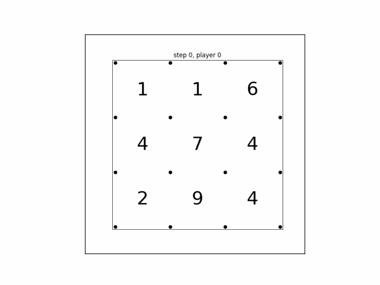

# Dots and Boxes

TenToHako is a Python package that allows you to play 'Dots and Boxes,' which is a famous pencil-and-paper game.
You can easily create the game server and test the basic AI algorithms such as min-max, Monte-Carlo tree search, and Q-learning.

## 1. Rule

'Dots and Boxes' is a classical pencil-and-paper game firstly published in the 19th century in France.
This game starts with an empty grid and dots, and each cell has a random value. Then, two players add a singly horizontal or vertical edge between two not-joined adjacent dots. If a player completes the fourth side of a 1x1 box, he earns the box's score. The game ends when players cannot place any line, and the winner is the player with the highest score.

## 2. Game System

The game system works as follows:

    1. The server creates the initial state (you can define any number of columns and rows and the range of scores)
    2. All clients connect to the server and give the client-specified username to the server.
    3. The server generates the user-id (1, or -1) and sends it to the clients. The client with id "1" will move first.
    4. The game starts and repeats the following a ~ b
        a. The server sends the current state to the clients
        b. The active player picks the action and sends it to the server
        c. THe server generates the new state from the received action and calculates the earned score
        d. The server switches the active player

The server sends the state to the clients in JSON format, and the JSON includes the following data.

    {"board_matrix": the current status of the board in nested-list representation,
     "ncol": number of columns of the board (int),
     "nrow": number of rows of the board (int),
     "done": indicates the game-over (bool),
     "score": {1: score of the player with ID 1, -1: score of the player with ID -1},
     "next_player": the ID of the next player}

The client also sends the picked action to the server in JSON as follows.

    {"j": y coordinate of the picked action,
     "i": x coordinate of the picked action}

## 3. Client/Agent

TenToHako offers the primary client and agent. The usage of the `Client` class is simple as the following example. If the `Client` instance is created with your agent and port number, the `client` automatically connects to the server, sends the agent's name, and receives the ID. Then, the `play` method allows the client to start the game.

    client = Client(agent, host_port, host_port)
    client.play()

The agent should have the `set_player_id`, `get_valid_action`, and `step` method. The `set_player_id` method sets the agent's id to the instance, and the `get_valid_action` method returns the list of valid actions based on the current state. The `step` method returns the picked action from the current state with the agent's algorithm. If you use Python, you can create your agent with BaseAgent that already implements `set_player_id` and `get_valid_action.`

## 4. Supported Algorithms

This package already implemented MIN/MAX, Monte-Carlo tree search with UCB (UCT), and Q-learning. The detailed comparison is coming soon!

